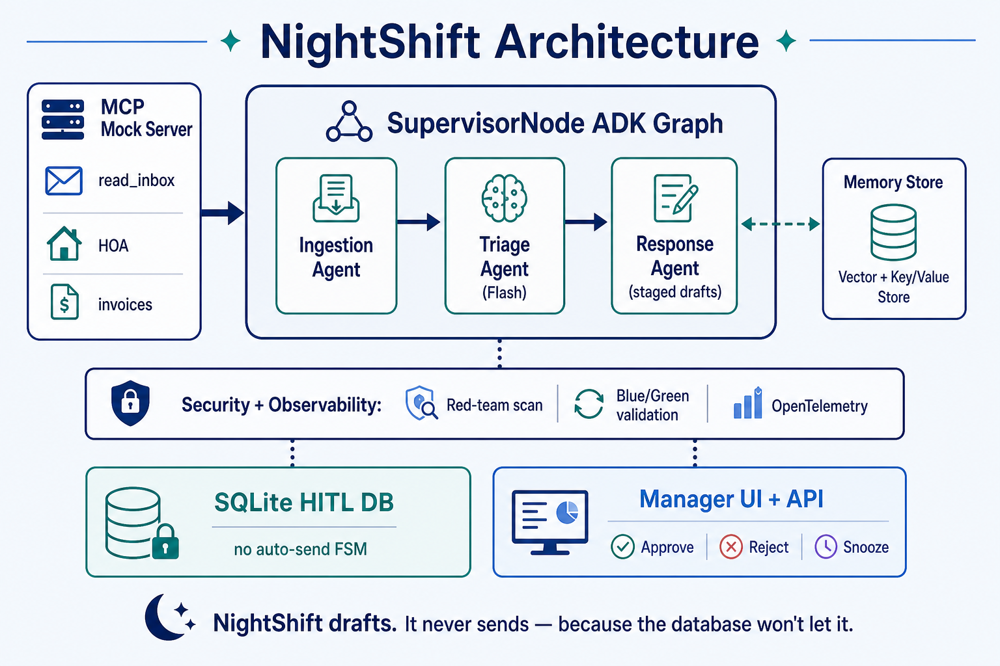

# NightShift

**NightShift drafts. It never sends. Not because the prompt says so — because phase 1 has no outbound send path, and the database enforces human approval.**

Overnight property-management agent for the Google 5-Day AI Agents Intensive (Vibe Coding) capstone. Ingests mock MCP sources, classifies urgency, drafts replies to a staging DB — human approval required before any send path.

## Problem

Property managers wake up to overnight email, HOA notices, tenant reports, and vendor invoices scattered across disconnected systems. Triage is slow, error-prone, and safety-critical — a mis-prioritized habitability issue or an auto-sent reply can create liability.

## Solution overview

NightShift runs a three-agent ADK graph overnight: **IngestionAgent** pulls mock MCP sources, **TriageAgent** classifies urgency (RED / YELLOW / GREEN / **SPAM**) with deterministic memory lookup, and **ResponseAgent** drafts replies to SQLite in `staged` status only. For RED and YELLOW items, the agent produces **two draft variants** — action-focused (Option A) and empathetic (Option B) — so Maria can pick the tone she prefers before approving. A Gmail-style UI lets the manager Approve / Reject / Snooze — but phase 1 has **no outbound send path**.

> **Phase 1 mock data:** All inbound mail comes from `mcp/fixtures/` (JSON + PDF attachments). There is no live Gmail, HOA portal, or vendor API in phase 1. The read-only MCP layer returns shared `RawItem` objects (`models/core.py`) so a **Gmail read-only backend can be swapped in during phase 2** without changing the ADK graph, triage, drafting, or HITL UI.

One-time after clone (PDF attachment fixtures):

```bash
python scripts/generate_pdf_fixtures.py
```

## Quick start

```bash
python -m venv .venv && source .venv/bin/activate
pip install -r requirements.txt
cp .env.example .env   # add your GEMINI_API_KEY — default uses live Gemini on demo subset

# Optional rules-only mode (no API calls): set TRIAGE_USE_STUB=1 and DRAFT_USE_STUB=1

python db/init_db.py
python main.py --dry-run          # verify ADK 2.0 graph
python main.py run-overnight      # overnight pipeline (Gemini on GEMINI_LIVE_ONLY_IDS when keyed)

# MCP mock server (separate terminal)
uvicorn mcp.server:app --reload --port 8000

pytest -q
bash scripts/pre_submit.sh
```

### Agents CLI equivalent

This repo uses `python main.py` as the documented equivalent of `agents-cli run` / `agents-cli test`:

| agents-cli | NightShift equivalent |
|------------|----------------------|
| `agents-cli run .` | `python main.py --dry-run` then `python main.py run-overnight` |
| `adk run . "ingest overnight batch"` | `python main.py run-overnight` |
| `agents-cli test` | `pytest tests/ -q` |

The ADK graph is defined in `agents/adk/graph.py` with three named sub-agents.

## Gmail-style UI (HITL demo)

```bash
# Terminal 1 — rebuild DB
bash scripts/rebuild_dev_db.sh

# Terminal 2 — UI API
bash scripts/run_ui_api.sh          # http://localhost:8001

# Terminal 3 — React UI
cd ui/nightshift-gmail && npm run dev   # http://localhost:5173
```

The UI reads `DraftRow` + `FailedItemRow` from SQLite and wires Approve / Reject / Snooze to the same `hitl/actions.py` as the CLI.

**UI highlights:**

| Feature | Behavior |
|---------|----------|
| **Dual draft picker** | RED/YELLOW items show Option A (action-focused) and Option B (empathetic) stacked; Maria selects one, edits if needed, then Approve saves the chosen text via `edit-approve`. |
| **Spam folder** | `email-010` (gift-card scam) classifies as **SPAM**; excluded from Inbox; folder highlights dark blue while unread (`read_at` null in DB). |
| **Sidebar filters** | Inbox, Staged, Urgent (RED), Follow-up (YELLOW), Spam, Approved, Snoozed, Rejected |
| **PDF attachments** | Detail pane: body + extracted attachment text + Download link |

### UI regression tests (Playwright)

```bash
bash scripts/run_ui_e2e.sh
```

E2E uses dedicated ports `:8002` / `:5174` and `ui_e2e.db` — separate from dev.

## Architecture

| Layer | Path | Role |
|-------|------|------|
| ADK graph | `agents/adk/graph.py` | Three named sub-agents (dry-run topology) |
| Supervisor | `agents/supervisor.py` | **Runtime orchestrator** — calls Ingestion, then Triage + Response per item |
| MCP | `mcp/server.py`, `mcp/loaders.py` | Read-only mock inbox / HOA / invoices (+ PDF text extraction) |
| Sandbox tools | `agents/triage/tools/` | Invoice audit + lease cross-reference |
| Contracts | `models/core.py` | `RawItem`, `ClassifiedItem`, `Draft` (incl. `draft_text_alt`) |
| HITL | `db/models.py`, `db/fsm.py` | CHECK constraint + FSM on update; `read_at` for spam unread |
| Policy | `policy/check_no_send.py` | Blocks `staged → ready_to_send` |

See [`mcp/README.md`](mcp/README.md) for MCP endpoint contracts.



Source SVG: [`docs/architecture.svg`](docs/architecture.svg)

**Diagram legend** (matches the figure above):

| Box / flow | Meaning |
|------------|---------|
| **SupervisorNode** | Python orchestrator — dispatches agents; does not call Gemini or MCP directly |
| **Ingestion / Triage / Response** | Three peer agents inside the orchestration zone; **agents never call each other** |
| **MCP Mock Server** | Read-only fixtures (`read_inbox`, HOA, invoices); Ingestion **calls** MCP and returns `RawItem[]` |
| **Gemini API** | Flash ← Triage Agent; Flash ← Response Agent; rules/templates fallback when stub or no key |
| **Memory Store** | Key/value JSON lookup (phase 1); Triage + Response **read** mid-run |
| **Violet dashed arrow → Memory** | Offline write via `memory/consolidate.py` — between batches only, never mid-run |
| **SQLite HITL DB** | `drafts` (staged → approved) + `overnight_runs` run metadata; FSM blocks auto-send |
| **Manager UI + API** | Approve / Reject / Snooze; reads/writes drafts through the same HITL layer |

**Arrow key:** navy = Supervisor → agent dispatch · teal = Ingestion ↔ MCP · grey dashed = Memory → agent (read) · grey solid = Response → SQLite (`staged`) · grey dashed from Supervisor = run metadata · orange dashed = agent → Gemini · violet dashed = offline memory consolidation · blue dashed = UI → DB.

**Swap-in point:** only MCP loaders change between phase 1 (fixtures) and phase 2 (e.g. Gmail read-only). **SupervisorNode** and the three agents stay the same; IngestionAgent still **calls** MCP read tools and returns `RawItem` objects.

**Runtime vs diagram:** Overnight processing is orchestrated by `SupervisorNode` — it calls Ingestion once, then Triage and Response per item. Agents do not call each other. The ADK `SequentialAgent` declares the three-agent topology for `python main.py --dry-run`. **Memory store** is JSON key/value lookup only (no vector DB in phase 1). **ResponseAgent** writes `draft_text` + optional `draft_text_alt`; at most **one** Gemini call per item (Option A when live; Option B is rules-only empathetic templates).

## Draft variants (RED / YELLOW)

| Option | Label | Source | Gemini? |
|--------|-------|--------|---------|
| **A** | Action-focused | Primary draft (`draft_text`) | 0–1 call when `GEMINI_LIVE_ONLY_IDS` matches |
| **B** | Empathetic | Alternate (`draft_text_alt`) | Never — deterministic rules templates |

GREEN and SPAM items have no tenant reply (single panel, no dual picker). Maria's Approve uses `POST /drafts/{id}/edit-approve` with the selected option's text.

## Demo script

Step-by-step capstone recording guide (hard case + PDF attachment + HITL): [`docs/demo_script.md`](docs/demo_script.md)

### PDF attachments (phase 1)

| Fixture | Story |
|---------|--------|
| `email-007` | Body says “by Friday”; PDF notice contains full date (`June 27 2026`) |
| `email-009` | Body has **no deadline**; stop-work PDF contains `Wednesday July 9 2026` only |

The UI detail pane shows **message body** and a separate **Attachments** section (extracted PDF text + **Download** for the source file). Triage and drafting consume merged `raw_text`; `extract_deadline()` prefers full PDF dates over weekday-only hints.

## Phase 2 roadmap — real Gmail (read-only)

Planned post-capstone extension — **not required for phase 1 submission**:

| Piece | Plan |
|-------|------|
| **Scope** | `gmail.readonly` only — no `gmail.send`; HITL + DB still block outbound mail |
| **Swap-in** | Replace `read_inbox` implementation in `mcp/loaders.py` (or add `mcp/gmail_loader.py`) |
| **Contract** | Same `RawItem` fields — agents, memory, security, UI unchanged |
| **Attachments** | Gmail API fetch → existing `mcp/pdf_parser.py` |
| **Tenant map** | Extend `memory/data/` with `From:` address → `tenant_id` |
| **Toggle** | Planned env: `INBOX_SOURCE=fixtures` (default) \| `gmail` |
| **OAuth** | Dedicated test Gmail account; tokens in `.env` (never committed) |

Phase 1 keeps curated fixtures for reproducible eval, E2E tests, and demo video. Phase 2 proves the architecture slide: *fixtures today, Gmail tomorrow, same pipeline.*

## Observability (OpenTelemetry)

Per-item traces cover ingest → triage → draft (`observability/tracing.py`):

- Span attributes: `item.id`, `triage_tier`, `agent.backend`, tool latency
- Token fields when Gemini is live (`gen_ai.usage.*`)
- PII/secrets redacted in spans and logs (`observability/redaction.py`)

```bash
# Default: in-memory spans (no collector required)
OTEL_USE_MEMORY=1 python main.py run-overnight

# Optional: export to local OTLP collector
OTEL_USE_MEMORY=0 OTEL_EXPORTER_ENDPOINT=http://localhost:4317 python main.py run-overnight
```

## Security (Effective Trust)

| Layer | Module | Role |
|-------|--------|------|
| **Red team** | `security/red_team.py` | Blocks prompt-injection patterns before triage |
| **Blue/Green** | `security/output_validation.py` | Catches cross-tenant emails in drafts |
| **Structural** | `db/fsm.py`, `policy/check_no_send.py` | HITL FSM — no auto-send even if LLM is manipulated |

Threat model summary: compromised MCP can corrupt **input**, not send mail; manipulated drafts still require manager approval; phase 1 does not solve stolen manager credentials.

## Pre-submit checks

```bash
bash scripts/pre_submit.sh   # policy + key scan + dry-run + pytest
bash scripts/scan_keys.sh    # API key pattern scan on tracked files
python policy/check_no_send.py
```

## Project structure

```
nightshift/
├── main.py                 # Supervisor CLI entrypoint
├── agents/                 # Ingestion, Triage, Response + ADK graph
├── mcp/                    # Mock MCP server + fixtures
├── memory/                 # Tenant→property lookup (JSON-backed)
├── models/core.py          # Shared Pydantic contracts
├── db/                     # SQLite + HITL FSM
├── api/                    # FastAPI UI backend
├── ui/nightshift-gmail/    # React HITL demo UI
├── policy/check_no_send.py # SDD no-send guard
├── observability/          # OpenTelemetry + PII redaction
├── security/               # Red-team scan + output validation
├── docs/architecture.png   # Architecture diagram (README + writeup)
├── docker/Dockerfile       # Container + /health
├── features/*.feature        # Gherkin specs (source of truth)
└── tests/                  # pytest + eval harness
```

## Hard case (eval)

`email-001` / `tenant-123`: *"The ceiling above my bathroom has a small water stain…"* → **RED**

Run the regression harness:

```bash
python main.py eval-urgency
pytest tests/eval_urgency.py tests/test_member_b.py tests/test_gherkin_features.py -q
```

**Sample confusion matrix (rules stub, 25 fixtures):**

```
expected \ predicted |   RED | YELLOW | GREEN
------------------------------------------------
RED                |    10 |      0 |       0
YELLOW             |     1 |      5 |       0
GREEN              |     0 |      0 |       9
```

Typical stub run: **96% accuracy**, false-RED **6.7%**, false-GREEN **0%**.

Targets (PRD §1.3): accuracy ≥90%, false-RED <15%, false-GREEN <2%.

Gherkin specs in `features/` are executable via `pytest-bdd` (`tests/test_gherkin_features.py`).

## Commands

```bash
python main.py --dry-run
python main.py run-overnight
python main.py eval-urgency
python main.py consolidate-memory
python main.py morning-brief
python main.py approve --draft-id X --manager "Jane Doe"
python main.py edit-approve --draft-id X --manager "Jane Doe" --text "Edited reply"
python main.py reject --draft-id X
python main.py snooze --draft-id X
python policy/check_no_send.py
pytest tests/ -q
```

## Docker (optional deploy evidence)

```bash
docker build -f docker/Dockerfile -t nightshift .
docker run --rm -p 8080:8080 nightshift
curl http://localhost:8080/health
```

## Scaling notes (TDD §2.6)

- **Concurrency:** `SupervisorNode` processes items with `ThreadPoolExecutor` (default 5 workers when stubs are on; set `GEMINI_CONCURRENCY=1` for free-tier Gemini).
- **Memory:** Phase 1 uses JSON files under `memory/data/`; production would move to a shared store with nightly consolidation only.
- **MCP swap-in:** Replace `mcp/loaders.py` backends without touching triage/response agents. **Phase 2:** Gmail read-only behind `read_inbox` (see roadmap above).
- **PDF ingestion:** Machine-readable PDFs in `mcp/fixtures/invoices/*.pdf` and email attachments are extracted to `RawItem.raw_text` via `mcp/pdf_parser.py` (no OCR for scanned PDFs in phase 1). UI serves fixture PDFs via `GET /attachments/{raw_item_id}/{filename}`.
- **Deploy:** Optional Cloud Run — build from `docker/Dockerfile`, inject `GEMINI_API_KEY` and `MCP_BASE_URL` as env vars.

## Team docs

- [`NightShift_PRD-V7.3.md`](NightShift_PRD-V7.3.md)
- [`NightShift_TDD-V7.3.md`](NightShift_TDD-V7.3.md)
- [`NightShift_Execution_Plan-V7.4.md`](NightShift_Execution_Plan-V7.4.md)
- [`AGENTS.md`](AGENTS.md)

## License

CC-BY-4.0 — see [`LICENSE`](LICENSE).
